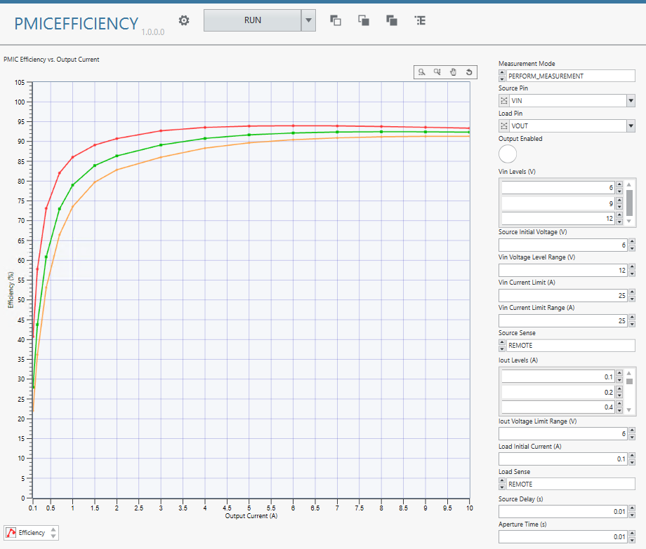

# AI-Driven PMIC Efficiency Measurement Plug-In

[](LICENSE)

A Python-based **Measurement Plug-In** for testing PMIC (Power Management IC) power conversion efficiency, built on the [NI Measurement Plug-Ins](https://www.ni.com/docs/en-US/bundle/measurementplugins/page/python-measurements.html) framework.

## Overview

This plug-in automates PMIC efficiency characterization by:

1. Sourcing a DC input voltage to the PMIC via an NI PPS or SMU
2. Sinking a DC load current from the PMIC output via an NI electronic load or SMU
3. Measuring input power (Vin × Iin) and output power (Vout × Iout)
4. Calculating power conversion efficiency: **η = Pout / Pin × 100%**

```
 NI PPS / SMU (source)          PMIC              NI Electronic Load / SMU (sink)
 ┌──────────────────┐      ┌──────────┐      ┌──────────────────────────────┐
 │  DC Voltage Out  │─────▶│  VIN  VOUT│─────▶│  DC Current Sink             │
 │  Current Measure │      └──────────┘      │  Voltage Measure             │
 └──────────────────┘                        └──────────────────────────────┘
      Pin = Vin × Iin                              Pout = Vout × Iout
                              η = Pout / Pin × 100%
```

## UI



## Hardware Requirements

| Role | Example Hardware | Driver |
|---|---|---|
| Input power source | NI PXIe-4151 (PPS) or nidcpower-compatible SMU | NI-DCPower |
| Output load | NI PXIe-4051 (electronic load) or nidcpower-compatible SMU | NI-DCPower |

## Software Requirements

- Python 3.10+
- NI InstrumentStudio 2025 Q4 or later
- NI-DCPower driver
- `ni_measurement_plugin_sdk` Python package
- `nidcpower` Python package

## Getting Started

### 1. Install the plug-in

```bash
cd src/pmic_efficiency
install.bat
```

> `install.bat` runs `poetry install --only main`. [Poetry](https://python-poetry.org/docs/) must be installed and on your PATH.

### 2. Start the measurement service

```bash
start.bat
```

### 3. Run a measurement

Open `PMICEfficiency.measui` in **Measurement Plug-In UI Editor** and press **Run**.

### Simulation mode (no hardware required)

Create a `.env` file in `src/pmic_efficiency/` with the following content:

```
MEASUREMENT_PLUGIN_NIDCPOWER_SIMULATE=1
MEASUREMENT_PLUGIN_NIDCPOWER_BOARD_TYPE=PXIe
MEASUREMENT_PLUGIN_NIDCPOWER_MODEL=4151
```

Then start the service normally with `start.bat`.

## Repository Structure

```
src/
  pmic_efficiency/        # PMIC efficiency measurement plug-in
  examples/
    meas-plugin/          # NI reference example (nidcpower_source_dc_voltage)
    nidcpower/            # Standalone nidcpower driver examples
docs/
  specs/                  # Formal specifications and PMIC-specific test cases
  test-design.md          # Four-layer test strategy (generic)
scripts/                  # Helper scripts (e.g. validate_measui.py)
.claude/                  # Claude Code automation: commands/, skills/, agents/
```

## Development

This project uses **Specification-Driven Development**. See [CLAUDE.md](CLAUDE.md) for the full development process and contribution guidelines.

### Automation (Claude Code)

If you work on this repo with [Claude Code](https://claude.com/claude-code), the three SDD
phases are automated by slash commands, run in order:

`/new-plugin <name>` → `/spec <name>` → `/test-cases <name>` → `/implement <name> <MeasurementName>`

Supporting tools (Claude invokes the skills and agent automatically when relevant):

- **Skills** — `find-meas-example` (find the verified sample for a `DataType` / `.measui`
  control) and `measurement-plugin-sdk` (`measurement.py` conventions).
- **Agent** — `spec-reviewer` reviews a draft spec against the project rules.
- **Script** — `python scripts/validate_measui.py <file.measui>` lints a `.measui` against
  known parser gotchas.

Each command, skill, and agent is self-documenting; see the files under `.claude/` for usage.

## License

[MIT License](LICENSE) © 2026 mminowa
